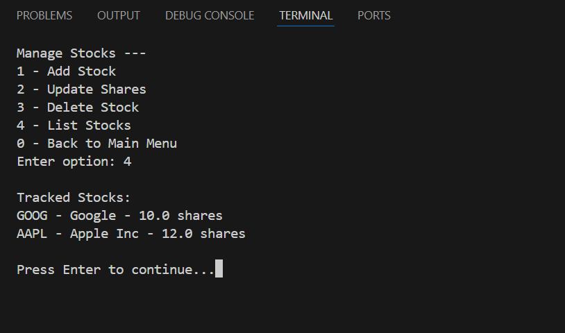
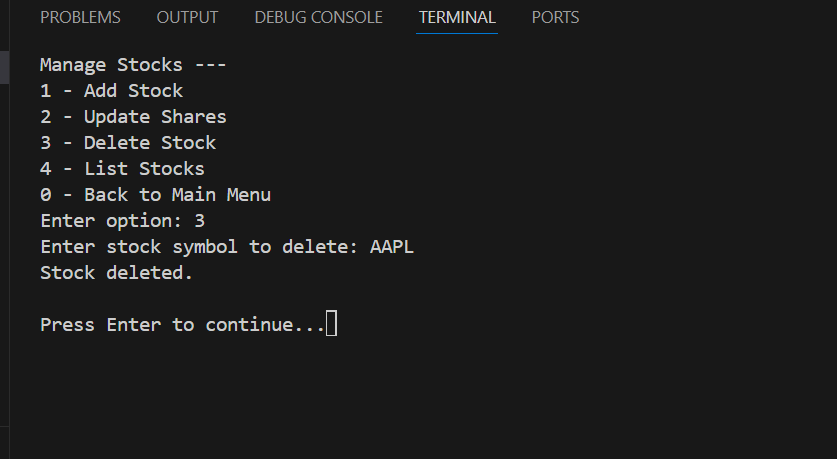
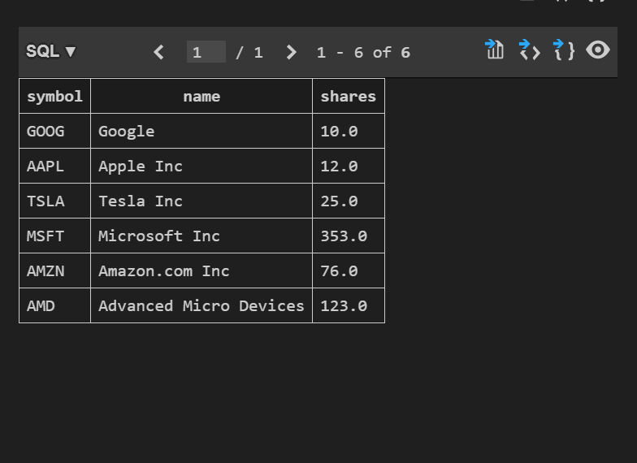

# Lab 2 - Stock Analysis


## Lab Objective

> The objective of this lab is to build a stock tracking system in Python that supports both a **console** and a **GUI** interface. Which allows users to:

> 1) Track stocks by symbol
> 2) Scrape stock data from Yahoo! Finance using Selenium and BeautifulSoup
> 3) Import data from downloaded `.csv` files
> 4) View price history, report, and many more
> 5) Save/load data using SQLite
> 6) Display stock trends as a chart

## Technologies Used

1. Python 3.x 
2. Tkinter (GUI)
3. Selenium + ChromeDriver
4. BeautifulSoup4 (bs4)
5. SQLite3
6. pandas
7. matplotlib

# 1. Implementing web scraping
## 1.1 Download Browser Driver 


## Set my path variable 


## 1.2 Implemented retrieve_stock_web()

Fetched the data from yahoo finance using start date an end date from the GUI version 


The fetches stock data of Netflix (NFLX)


## 1.4 Tested the code

### GUI:
1. Add stock `AMD` with 10 shares.
2. Scrape Yahoo! Finance data for `4/1/24` to `4/30/24`.
3. Download a `.csv` from Yahoo and import it.
4. Switch tabs to **History** and **Report**.
5. View the chart using **Chart → Show Stock Chart**.
6. Save the data. Restart the app. Load the data again.

### Interface


### GUI chart


### GUI report


### GUI History


### Updating shares in GUI

## 1.5 Implemented  retrieve_from_web()

## Console:
1. Use menu option 1 to add a stock.
2. Use option 2 to enter daily price data.
3. Use option 3 to show the report.
4. Use option 5 → retrieve from web or import CSV.
5. Show chart for any stock.

### List stocks


### Adding a stock 


### Updating a share


### Deleting a share 


### Stock report 


### Stock chart


### Retrieve data from web


# 2. Data save/import/load from CSV 

### Importing data from GUI


### Saving the data in GUI


### All the stocks in the stock DB


### Number of records fetched 


### selecting required stock using sqlite from dailyData


### Records in the DB


## How to Run

### Install dependencies:
```bash
pip install selenium beautifulsoup4 pandas matplotlib
```

### Run GUI:
```bash
python stock_GUI.py
```

### Run Console:
```bash
python stock_console.py
```
### Console program 

Once you run the code do not forget to first click 5(Manage Data) and then 1(Save to Database) in order to load the data from memory to the database and you can perform required actions in stock_console.py.

### GUI program

As soon as you run the stock_GUI.py add the stocks and then perform required action by selecting paticular stock name.

### Or launch from unified script:
```bash
python stocks.py
```
## Link 

> GitHub: [https://github.com/shulamite512/DATA-200/tree/main]
